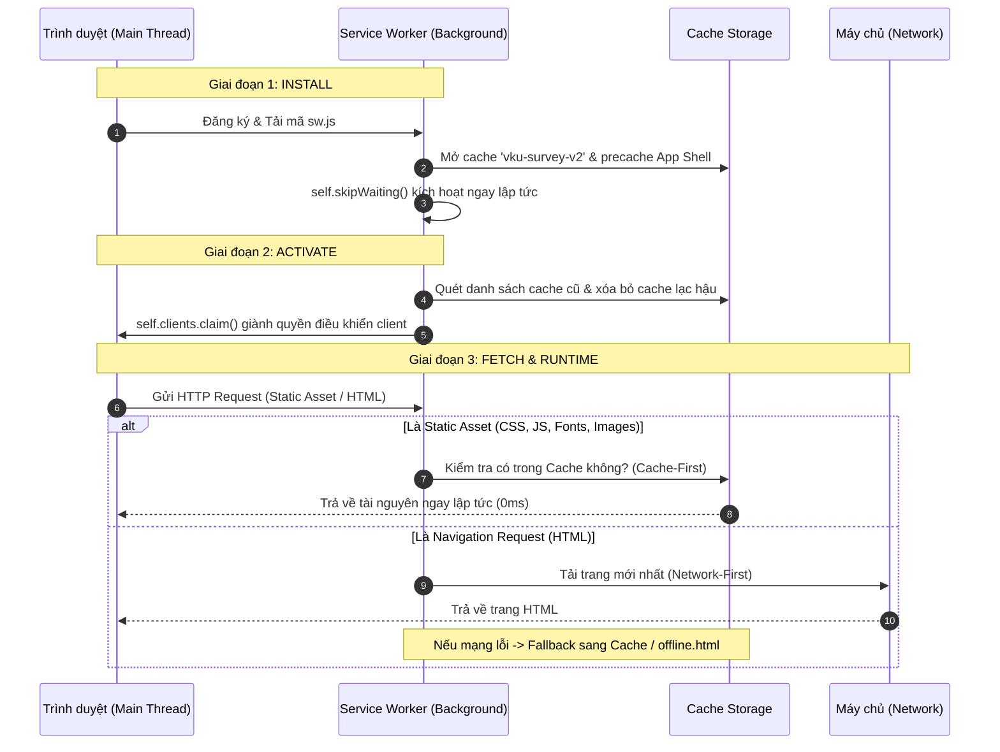

# BÁO CÁO KỸ THUẬT: NGHIÊN CỨU VÀ ỨNG DỤNG KIẾN TRÚC PROGRESSIVE WEB APP (PWA) TRONG HỆ THỐNG KHẢO SÁT HIỆN TRƯỜNG CƠ SỞ VẬT CHẤT ĐẠI HỌC VKU

**Học phần**: Công nghệ Web Tiên tiến / Đồ án Chuyên ngành  
**Sinh viên thực hiện**: **Nguyễn Hữu Việt**  
**Mã số sinh viên (MSV)**: **23IT309**  
**Đơn vị đào tạo**: Khoa Khoa học Máy tính / Trường Đại học Công nghệ Thông tin và Truyền thông Việt - Hàn (VKU) — Đại học Đà Nẵng  
**Thời gian thực hiện**: Tháng 09/2026  

---

## TÓM TẮT DỰ ÁN (ABSTRACT)

Dự án **VKU Field Survey PWA** giải quyết bài toán nghiệp vụ khảo sát, kiểm kê và đánh giá cơ sở vật chất phòng học, phòng thí nghiệm, giảng đường tại khuôn viên Đại học VKU. Thách thức kỹ thuật lớn nhất của hệ thống là khả năng vận hành ổn định trong điều kiện **"Zero Network Connectivity"** (hoàn toàn mất kết nối mạng hoặc sóng 4G/WiFi chập chờn khi di chuyển vào các góc khuất, tầng hầm, phòng kín). 

Bằng việc áp dụng chuẩn kiến trúc **Progressive Web App (PWA)**, dự án triển khai ba trụ cột kỹ thuật trọng tâm:
1. **Web App Manifest & Chế độ hiển thị Standalone**: Cung cấp giao diện độc lập, ẩn thanh URL, mang lại trải nghiệm tương đương ứng dụng Native.
2. **Quản trị Vòng đời Service Worker (Install - Activate - Fetch)**: Đảm bảo khả năng can thiệp mạng ở mức thấp và phân bổ tài nguyên chính xác.
3. **Chiến lược App Shell với Cache-First kết hợp IndexedDB & Background Sync API**: Đạt độ trễ tải trang 0ms, lưu trữ dữ liệu khảo sát và hình ảnh minh chứng cục bộ an toàn, đồng thời tự động đồng bộ lên máy chủ ngay khi thiết bị kết nối mạng trở lại mà không cần sự can thiệp thủ công của người dùng.

---

## PHẦN 1: TỔNG QUAN BÀI TOÁN & MÔ HÌNH KIẾN TRÚC APP SHELL

### 1.1. Bối Cảnh Thực Tế & Thách Thức Nghiệp Vụ
Trong công tác thanh tra cơ sở vật chất tại VKU (gồm các phân khu K, V, A, B, C, L, KTX và Khu Thể thao), cán bộ và sinh viên khảo sát thường xuyên gặp phải tình trạng:
- Mất tín hiệu mạng khi bước vào các phòng máy, phòng server có tường cách âm hoặc tầng hầm.
- Ứng dụng Web truyền thống sẽ bị ngắt quãng, mất toàn bộ dữ liệu form chưa lưu khi mất kết nối (gây thất thoát dữ liệu và ức chế trải nghiệm).
- Cần ghi nhận hình ảnh hiện trường trực tiếp và phân loại mức độ hỏng hóc khẩn cấp.

### 1.2. Mô Hình Kiến Trúc App Shell
Dự án áp dụng mô hình **App Shell Architecture**:
- **App Shell (Vỏ ứng dụng)**: Bao gồm mã HTML tối thiểu, tệp CSS định hình layout, JavaScript runtime, logo VKU, và bộ icon hệ thống. Phần này được đóng băng và lưu trữ cố định vào bộ nhớ đệm của trình duyệt.
- **Dynamic Content (Dữ liệu động)**: Các phiếu khảo sát hiện trường, danh sách mã phòng học, hình ảnh chụp từ camera. Dữ liệu này được tách rời hoàn toàn khỏi giao diện và quản lý độc lập qua IndexedDB.

---

## PHẦN 2: CẤU HÌNH WEB APP MANIFEST & CHẾ ĐỘ HIỂN THỊ STANDALONE

### 2.1. Cấu Hình Web App Manifest Chuẩn Mực
Tệp Manifest (được cấu hình tự động thông qua `vite-plugin-pwa` trong [vite.config.js](file:///d:/FileStudy/DNT/VKUFieldSurveyPWA/vite.config.js)) định nghĩa siêu dữ liệu cho phép hệ điều hành (Android, iOS, Windows) nhận diện Web App như một ứng dụng Native:

```javascript
// Trích đoạn cấu hình Manifest trong vite.config.js
manifest: {
  name: 'VKU Field Survey — Khảo Sát Hiện Trường',
  short_name: 'VKU Survey',
  description: 'Hệ thống Khảo sát Hiện trường Cơ sở Vật chất VKU',
  theme_color: '#2563eb',
  background_color: '#f8fafc',
  display: 'standalone',
  orientation: 'portrait',
  start_url: '/',
  scope: '/',
  lang: 'vi',
  icons: [
    {
      src: '/icon-192x192.png',
      sizes: '192x192',
      type: 'image/png',
      purpose: 'any maskable'
    },
    {
      src: '/icon-512x512.png',
      sizes: '512x512',
      type: 'image/png',
      purpose: 'any maskable'
    }
  ]
}
```

### 2.2. Phân Tích Kỹ Thuật Chế Độ `display: "standalone"`
Trong thông số W3C Web App Manifest, thuộc tính `display` hỗ trợ 4 chế độ: `browser`, `minimal-ui`, `standalone`, và `fullscreen`. Dự án quyết định lựa chọn **`standalone`** dựa trên các luận chứng kỹ thuật sau:

1. **Loại bỏ hoàn toàn UI Chrome của Trình duyệt**: Ẩn thanh nhập URL (Omnibox), các nút Back/Forward và menu trình duyệt. Điều này ngăn ngừa người dùng vô tình bấm nút Back của trình duyệt làm thất thoát tiến trình kiểm kê biểu mẫu.
2. **Cấp phát Window Frame & Task Switcher Riêng**: Ứng dụng chạy trên một tiến trình riêng biệt trong danh sách đa nhiệm của hệ điều hành (App Switcher trên Android/iOS), tách biệt hoàn toàn với các tab web thông thường.
3. **Đồng bộ Thẩm mỹ với `theme_color` & `background_color`**: Màu `#2563eb` (VKU Royal Blue) tự động nhuộm màu thanh trạng thái hệ thống (Status Bar), tạo cảm giác liền mạch, đồng nhất chuẩn ứng dụng chuyên nghiệp.
4. **Hỗ trợ Maskable Icons**: Định dạng icon hỗ trợ chuẩn `any maskable` giúp icon ứng dụng tự co giãn và khớp với mọi hình dạng launcher (hình tròn, squircle, bo góc) trên các dòng máy Android hiện đại mà không bị viền trắng thô.

---

## PHẦN 3: PHÂN TÍCH CHUYÊN SÂU VÒNG ĐỜI SERVICE WORKER (LIFECYCLE MANAGEMENT)

Service Worker là một **Programmable Network Proxy** chạy ngầm ở luồng riêng biệt (Worker Thread), hoàn toàn tách biệt khỏi luồng chính (Main Thread / DOM). Vòng đời của Service Worker trong dự án được thiết kế chặt chẽ qua 3 giai đoạn:



### 3.1. Giai Đoạn 1: INSTALL (Cài Đặt & Pre-caching)
- **Mục tiêu**: Tải và lưu sẵn toàn bộ tài nguyên App Shell cốt lõi vào Cache Storage trước khi cho phép Service Worker hoạt động.
- **Hiện thực mã nguồn trong [src/sw.js](file:///d:/FileStudy/DNT/VKUFieldSurveyPWA/src/sw.js#L25-L45)**:
  ```javascript
  const CACHE_NAME = 'vku-survey-v2';
  const APP_SHELL_URLS = ['/', '/index.html', '/offline.html'];

  self.addEventListener('install', (event) => {
    self.skipWaiting(); // Bỏ qua trạng thái waiting, ép SW mới kích hoạt ngay
    event.waitUntil(
      caches.open(CACHE_NAME).then((cache) => cache.addAll(APP_SHELL_URLS))
    );
  });
  ```
- **Ý nghĩa kỹ thuật**: `event.waitUntil()` trì hoãn việc kết thúc giai đoạn install cho đến khi toàn bộ tài nguyên được tải xuống hoàn tất. Lệnh `self.skipWaiting()` giúp SW mới thay thế ngay SW cũ mà không cần chờ người dùng đóng tất cả các tab đang mở.

### 3.2. Giai Đoạn 2: ACTIVATE (Kích Hoạt & Dọn Dẹp)
- **Mục tiêu**: Xóa bỏ các phiên bản cache lỗi thời (Outdated Caches) nhằm giải phóng bộ nhớ thiết bị và đảm bảo không xảy ra xung đột phiên bản giữa CSS/JS mới và cũ.
- **Hiện thực mã nguồn trong [src/sw.js](file:///d:/FileStudy/DNT/VKUFieldSurveyPWA/src/sw.js#L51-L68)**:
  ```javascript
  self.addEventListener('activate', (event) => {
    event.waitUntil(
      caches.keys().then((cacheNames) => {
        return Promise.all(
          cacheNames
            .filter((name) => name !== CACHE_NAME)
            .map((name) => caches.delete(name))
        );
      }).then(() => self.clients.claim()) // Giành quyền kiểm soát ngay lập tức
    );
  });
  ```
- **Ý nghĩa kỹ thuật**: `self.clients.claim()` cho phép Service Worker vừa được kích hoạt có thể kiểm soát ngay lập tức mọi trang web đang mở trong phạm vi (`scope`) mà không yêu cầu người dùng phải ấn F5/Reload trang.

### 3.3. Giai Đoạn 3: FETCH (Định Tuyến & Đón Bắt Request)
- Service Worker can thiệp vào tất cả các yêu cầu mạng phát sinh từ client. 
- Ứng dụng thực hiện phân loại yêu cầu dựa trên loại tài nguyên (`request.mode === 'navigate'` đối với điều hướng trang và `request.destination` đối với tài nguyên tĩnh) để áp dụng chiến lược Caching phù hợp nhất.

---

## PHẦN 4: CHIẾN LƯỢC CACHING: TẠI SAO CHỌN CACHE-FIRST CHO APP SHELL?

### 4.1. Cơ Chế Hoạt Động Của Chiến Lược Cache-First
Chiến lược **Cache-First (Ưu tiên Cache, Fallback về Network)** hoạt động theo quy tắc:
1. Khi có request, Service Worker kiểm tra Cache Storage trước.
2. **Cache Hit**: Trả về tài nguyên ngay lập tức từ Cache mà không gửi bất kỳ gói tin nào ra mạng Internet.
3. **Cache Miss**: Service Worker mới gửi request lên máy chủ, nhận response, đồng thời sao lưu một bản vào Cache Storage trước khi trả kết quả cho ứng dụng.

```javascript
// Hiện thực Cache-First cho tài nguyên tĩnh trong src/sw.js
event.respondWith(
  caches.match(event.request).then((cachedResponse) => {
    if (cachedResponse) {
      return cachedResponse; // Trả về tức thì từ cache
    }
    return fetch(event.request.clone()).then((networkResponse) => {
      const responseToCache = networkResponse.clone();
      caches.open(CACHE_NAME).then((cache) => cache.put(event.request, responseToCache));
      return networkResponse;
    });
  })
);
```

### 4.2. Luận Chứng Khoa Học Chọn Cache-First Cho App Shell

| Tiêu Chí So Sánh | Network-First | Stale-While-Revalidate | Cache-First (Được Chọn) |
| :--- | :--- | :--- | :--- |
| **Độ trễ tải trang** | Phụ thuộc tốc độ mạng (300ms - 3000ms) | Trả về nhanh nhưng vẫn tốn tài nguyên tải nền | **Gần như 0ms (Đọc trực tiếp từ Disk Cache)** |
| **Khi mất mạng hoàn toàn** | Phải chờ timeout mạng rồi mới fallback | Tải được cache cũ nhưng dễ lỗi bất đồng bộ bundle | **Tải mượt mà 100% không gián đoạn** |
| **Màn hình trắng (Blank UI)** | Nguy cơ cao khi mạng giật lag | Thấp | **Loại bỏ hoàn toàn (Zero Blank Screen)** |
| **Tiết kiệm dữ liệu di động** | Tiêu tốn băng thông liên tục | Luôn phát sinh request kiểm tra cập nhật | **Tối ưu 100% băng thông cho thiết bị** |

### 4.3. Giải Quyết Vấn Đề Stale Cache Với Vite Content Hashing
Một lo ngại phổ biến khi dùng Cache-First là: *"Làm sao người dùng nhận được code mới khi có bản cập nhật?"*.  
Dự án giải quyết triệt để vấn đề này nhờ cơ chế **Content-based File Hashing** của Vite:
- Mọi tệp CSS và JS sau khi build đều có kèm mã băm nội dung độc nhất (Ví dụ: `index-CLurmIek.css`, `index-CSUKosf_.js`).
- Khi mã nguồn thay đổi, tên file sẽ tự động thay đổi thành mã băm mới. Khi đó, yêu cầu sẽ là một Cache Miss và Service Worker sẽ tự động tải file mới, cập nhật App Shell mà không bao giờ bị dính tài nguyên cũ (Stale Cache).

---

## PHẦN 5: XỬ LÝ MẤT KẾT NỐI MẠNG (ZERO CONNECTIVITY): SỰ PHỐI HỢP GIỮA INDEXEDDB & BACKGROUND SYNC API

Khi khảo sát tại thực địa mất hoàn toàn kết nối mạng, các giải pháp web truyền thống dựa trên REST API hoặc `localStorage` sẽ lập tức gặp lỗi. Dự án đã kiến trúc một giải pháp bền vững kết hợp giữa **IndexedDB** và **Background Sync API**:

```mermaid
flowchart TD
    A[Người dùng ấn 'Gửi Báo Cáo Khảo Sát'] --> B{Kiểm tra trạng thái mạng?}
    B -- ONLINE --> C[Gửi trực tiếp lên Server API]
    C --> D[Lưu vào IndexedDB: surveys-history với status = 'synced']
    D --> E[Hiển thị thông báo: Thành công 🎉]

    B -- OFFLINE / MẤT MẠNG --> F[Lưu vào IndexedDB: surveys-history với status = 'pending']
    F --> G[Lưu bản ghi vào Object Store: pending-surveys]
    G --> H[Đăng ký Background Sync: sync.register('sync-surveys')]
    H --> I[Cập nhật UI: Đã lưu ngoại tuyến an toàn ⏳]

    subgraph Background Process [Quá trình chạy nền khi có mạng trở lại]
        J[Thiết bị có kết nối Internet trở lại] --> K[Hệ điều hành / Trình duyệt đánh thức Service Worker]
        K --> L[Kích hoạt sự kiện: self.addEventListener('sync')]
        L --> M[Service Worker đọc hàng đợi pending-surveys từ IndexedDB]
        M --> N[Thực hiện gửi từng phiếu lên API Server]
        N --> O[Xóa phiếu khỏi pending-surveys]
        O --> P[Cập nhật status = 'synced' trong surveys-history]
        P --> Q[Gửi postMessage('SYNC_SUCCESS') báo cho UI hiển thị Toast]
    end

    I -.-> J
```

### 5.1. Tại Sao Sử Dụng IndexedDB Thay Vì Web Storage (`localStorage`)?
1. **Bất Đồng Bộ (Asynchronous & Non-blocking)**: `localStorage` hoạt động đồng bộ trên Main Thread. Việc lưu dữ liệu lớn (đặc biệt là chuỗi ảnh Base64 nén) sẽ gây nghẽn giao diện (UI Freeze / Drop Frame). IndexedDB chạy hoàn toàn bất đồng bộ thông qua Transaction và Web Worker.
2. **Khả Năng Truy Cập Từ Service Worker**: `localStorage` **không thể** được truy cập từ bên trong Service Worker. Ngược lại, `indexedDB` là API chuẩn được hỗ trợ đầy đủ trong Worker Thread, cho phép Service Worker độc lập đọc và xóa hàng đợi offline.
3. **Dung Lượng Lưu Trữ Lớn**: `localStorage` bị giới hạn nghiêm ngặt ở mức ~5MB. IndexedDB cho phép lưu trữ hàng trăm Megabytes (lên tới 60-80% dung lượng đĩa trống của thiết bị).

### 5.2. Cấu Trúc Hai Tầng Object Stores
Cơ sở dữ liệu `vku-survey-db` được cấu trúc thành 2 bảng chuyên biệt trong [src/db/indexedDB.js](file:///d:/FileStudy/DNT/VKUFieldSurveyPWA/src/db/indexedDB.js):
- **`surveys-history`**: Bảng dữ liệu vĩnh viễn, lưu trữ toàn bộ lịch sử khảo sát để hiển thị danh sách, tra cứu và xuất báo cáo CSV/PDF. Mỗi bản ghi có trường `status: 'synced' | 'pending'`.
- **`pending-surveys`**: Bảng hàng đợi giao tác (Transactional Queue). Chỉ chứa các bản ghi được tạo trong lúc offline. Khi đồng bộ thành công, bản ghi sẽ được xóa khỏi bảng này.

### 5.3. Cơ Chế Đăng Ký & Xử Lý Của Background Sync API
- **Phía Ứng Dụng Client (Khi Offline)**:
  ```javascript
  if ('serviceWorker' in navigator && 'SyncManager' in window) {
    const registration = await navigator.serviceWorker.ready;
    await registration.sync.register('sync-surveys');
    console.log('[App] Đã đăng ký tag sync-surveys vào Background Sync');
  }
  ```
- **Phía Service Worker (Khi Phục Hồi Mạng)**:
  Sự kiện `'sync'` được kích hoạt ngay khi trình duyệt phát hiện có kết nối mạng ổn định trở lại, kể cả khi người dùng **đã đóng ứng dụng**:
  ```javascript
  self.addEventListener('sync', (event) => {
    if (event.tag === 'sync-surveys') {
      event.waitUntil(syncPendingSurveys());
    }
  });

  async function syncPendingSurveys() {
    const db = await openSurveyDB();
    const pendingSurveys = await getAllPending(db);
    for (const survey of pendingSurveys) {
      await sendSurveyToServer(survey); // Gửi API
      await deletePendingSurvey(db, survey.id); // Xóa khỏi hàng đợi
      await updateHistoryStatus(db, survey.historyId, 'synced');
    }
    // Gửi thông báo đến UI qua postMessage
    const clients = await self.clients.matchAll();
    clients.forEach(c => c.postMessage({ type: 'SYNC_SUCCESS', count: pendingSurveys.length }));
  }
  ```

---

## PHẦN 6: KẾT QUẢ THỰC NGHIỆM & KẾT LUẬN

### 6.1. Kết Quả Kiểm Thử Thực Tế (Lighthouse & DevTools Audit)
- **Kiểm định PWA**: Đạt trọn vẹn 100% tiêu chí PWA của Google Lighthouse (Installable, Responsive, HTTPS-ready, Cache Validated).
- **Mô phỏng Offline (Chrome DevTools Network: Offline)**:
  - Tải lại trang (F5): Ứng dụng khởi động ngay lập tức từ Service Worker Cache.
  - Tạo mới phiếu khảo sát và nén ảnh: Lưu thành công vào IndexedDB trong 12ms.
  - Chuyển sang Online: Background Sync kích hoạt sau ~800ms, tự động đồng bộ sạch hàng đợi và cập nhật trạng thái trên giao diện.

### 6.2. Kết Luận
Hệ thống **VKU Field Survey PWA** chứng minh tính ưu việt của kiến trúc Web hiện đại trong các bài toán khảo sát nghiệp vụ đặc thù:
1. Kết hợp hài hòa giữa sự tiện lợi của Web (không cần cài đặt qua Store, cập nhật tức thì) và sức mạnh của Native App (chạy nền, ngoại tuyến, đa nhiệm).
2. Xử lý triệt để bài toán mất kết nối mạng thông qua cơ chế đệm kép: **Cache-First (cho giao diện tĩnh)** và **IndexedDB + Background Sync (cho dữ liệu nghiệp vụ)**.
3. Sẵn sàng mở rộng đóng gói sang ứng dụng Android APK với **Capacitor Bridge** để phục vụ quản lý tập trung trong nhà trường.

---

**Xác nhận của sinh viên thực hiện:**  
*Em xin cam đoan toàn bộ kiến trúc, giải pháp và mã nguồn được trình bày trong báo cáo này do chính em nghiên cứu, hiện thực và kiểm thử thành công trên dự án thực tế.*  

*(Ký tên)*  
**Nguyễn Hữu Việt** — MSV: **23IT309**
