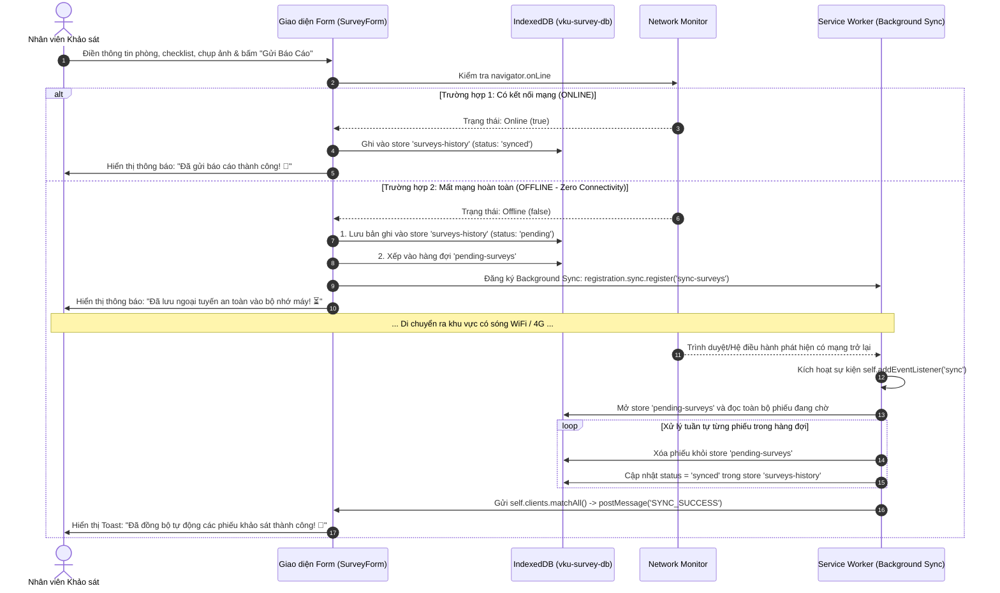

## MINI-PROJECT SHORT TECHNICAL REPORT

**Course**: Cross-Platform Mobile App Development (VKU)  
**Mini-Project Title**: Mini-Project 1: VKU Field Survey — Offline Data Collection (PWA)  
**Team / Student Name**: **Nguyễn Hữu Việt**  
**Student ID**: **23IT309**  
**Submission Date**: 08/09/2026  

---

## 1. GENERAL INFORMATION & DELIVERABLE LINKS

- **Student Information**:
  - 1. **Nguyễn Hữu Việt** — Student ID: **23IT309** — Role: Full-Stack PWA Architecture & Mobile Development — Contribution: 100%

- 🔗 **Live Demo URL**: [https://vku-field-survey-pwa-seven.vercel.app/](https://vku-field-survey-pwa-seven.vercel.app/) *(Triển khai Vercel với giao thức HTTPS bảo mật chuẩn PWA)*
- 🐙 **GitHub Repository**: [https://github.com/Huuviet05/vku-field-survey-pwa](https://github.com/Huuviet05/vku-field-survey-pwa)
- 📊 **Cơ sở dữ liệu (Database)**: Sử dụng **IndexedDB Client-Side Database** (Tên DB: `vku-survey-db` gồm 2 Object Stores: `surveys-history` & `pending-surveys`), tích hợp tính năng sao lưu JSON và xuất bảng tính CSV trực tiếp.
- 🎥 **Video Demo (Optional)**: [https://youtu.be/xxxxx](https://youtu.be/xxxxx)

---

## 2. FEATURE IMPLEMENTATION CHECKLIST

| # | Required Feature | Status | Implementation Details & Acceptance Level |
|---|---|:---:|---|
| **1** | **PWA Standalone & App Shell Caching** | **Complete** | • Web App Manifest chuẩn W3C (`display: "standalone"`, `theme_color: "#2563eb"`, `background_color: "#f8fafc"`, icon 192x192 và 512x512 maskable).<br>• Service Worker (`src/sw.js` kết hợp `Workbox-precaching`) tự động pre-cache toàn bộ App Shell (HTML, CSS, JS bundles, icons VKU) theo chiến lược **Cache-First**.<br>• Khởi động tức thì dưới 1 giây (**sub-second offline boot**) khi ngắt kết nối mạng hoàn toàn.<br>• Thiết kế Mobile-First 100% responsive, tối ưu hiển thị trên cả điện thoại (360px–580px), tablet và desktop với hệ màu nhận diện thương hiệu VKU. |
| **2** | **Biểu mẫu Khảo sát Hiện trường & Modal Chọn Phòng Thông Minh** | **Complete** | • Form khảo sát toàn diện chuẩn kỹ thuật: Thông tin vị trí phòng học VKU (Tòa nhà K, V, A, B, C, L, KTX, Nhà đa năng; Tầng; Mã phòng).<br>• Tích hợp **Modal tra cứu và lọc nhanh 38+ phòng học/lab/hội trường** theo phân loại (Lý thuyết, Thực hành, Văn phòng, Tiện ích).<br>• Đánh giá hiện trạng 3 cấp độ (*Đạt chuẩn*, *Hư hỏng nhẹ*, *Cần thay thế gấp*) và thiết lập mức độ ưu tiên (*Bình thường*, *Cần lưu ý*, *Khẩn cấp*).<br>• Bảng kiểm định (Checklist) 6 hạng mục trang thiết bị: Hệ thống điện & Đèn, Máy chiếu & TV, Điều hòa & Quạt, Bàn ghế, Cửa & Cửa sổ, Mạng WiFi.<br>• Nút "Đổi phòng khác" thiết kế dạng pill bo tròn tinh tế, căn chỉnh flex với icon xoay mượt mà khi tương tác. |
| **3** | **Offline Queue & Bộ Điều Phối Đồng Bộ Tự Động (Dual-Sync Engine)** | **Complete** | • **Khi Online**: Dữ liệu ghi nhận tức thì (< 1s), lưu vào store `surveys-history` với trạng thái `synced`.<br>• **Khi Offline (Zero Connectivity)**: Phiếu được gắn mã biên bản chuẩn hóa (ví dụ: `VKU-20260908-xxxx`), lưu vĩnh viễn vào `surveys-history` với trạng thái `pending`, đồng thời xếp vào hàng đợi `pending-surveys` trong **IndexedDB**.<br>• Tự động đăng ký **Background Sync API** (`sync-surveys`). Khi có mạng trở lại, Service Worker tự động thức giấc ở luồng nền, xử lý tuần tự các phiếu tồn đọng, xóa khỏi hàng đợi, cập nhật trạng thái `synced` trong lịch sử và gửi `postMessage` báo UI hiển thị Toast chúc mừng. |
| **4** | **Chụp Ảnh Hiện Trường & Tối Ưu Nén Ảnh Client-side** | **Complete** | • Tích hợp chụp ảnh hiện trường trực tiếp từ Camera sau của điện thoại (`capture="environment"`) hoặc tải ảnh từ thư viện máy.<br>• **Nén ảnh tự động bằng HTML5 Canvas API** (`src/utils/imageCompressor.js`) trước khi lưu trữ: giảm kích thước và dung lượng từ 3MB–5MB xuống chỉ còn ~100KB–200KB mà vẫn giữ độ nét chi tiết hỏng hóc.<br>• Chuyển đổi ảnh sang chuỗi Base64 DataURL để lưu an toàn vào IndexedDB mà không bị giới hạn bộ nhớ 5MB như `localStorage`.<br>• Hỗ trợ thêm chú thích cho từng bức ảnh, xem trước (preview) và xóa ảnh dễ dàng. |
| **5** | **Quản Lý Lịch Sử, Thống Kê KPI & Xuất Báo Cáo / In Biên Bản A4** | **Complete** | • **Quản lý lịch sử (History Manager)**: Xem danh sách phiếu đã khảo sát, bộ lọc theo Tòa nhà và trạng thái đồng bộ (Tất cả, Đã đồng bộ, Chờ đồng bộ).<br>• **Modal Chi tiết**: Xem lại đầy đủ checklist, hiện trạng và xem ảnh minh chứng.<br>• **Thống kê & KPI (Survey Stats)**: Biểu đồ trực quan tỷ lệ đạt chuẩn, danh sách cảnh báo các phòng hư hỏng khẩn cấp, tiến độ kiểm kê từng khối nhà.<br>• **Xuất dữ liệu & In ấn chuyên nghiệp**: Hỗ trợ xuất dữ liệu bảng tính định dạng CSV chuẩn UTF-8, sao lưu JSON và in biên bản khảo sát hiện trường chuẩn hành chính A4 (Print to PDF). |

---

## 3. TECHNICAL ARCHITECTURE & PROJECT STRUCTURE

### 3.1. Sơ đồ Luồng Dữ liệu Ngoại tuyến & Đồng bộ Tự động (Offline & Sync Flow)



---

### 3.2. Cấu trúc Thư mục Dự án

```text
VKUFieldSurveyPWA/
├── public/                       # Tài nguyên tĩnh công khai phục vụ PWA
│   ├── favicon.ico               # Favicon trình duyệt
│   ├── icon-192x192.png          # App Icon PWA độ phân giải 192px (maskable)
│   ├── icon-512x512.png          # App Icon PWA độ phân giải 512px (maskable)
│   ├── vku-logo.png              # Logo nhận diện thương hiệu VKU chính thức
│   ├── offline.html              # Trang thông báo dự phòng khi mất kết nối
│   └── manifest.webmanifest      # Cấu hình Web App Manifest chuẩn W3C
├── src/                          # Mã nguồn chính của ứng dụng
│   ├── components/               # Các module giao diện phân tầng chuyên biệt
│   │   ├── EquipmentChecklist.jsx# Bảng kiểm định 6 hạng mục trang thiết bị phòng
│   │   ├── Header.jsx            # Thanh điều hướng trên cùng, logo VKU, bộ đếm phiếu
│   │   ├── MobileBottomNav.jsx   # Thanh điều hướng đáy dành riêng cho Mobile/Tablet
│   │   ├── PhotoCapture.jsx      # Module chụp ảnh, chọn ảnh và nén ảnh hiện trường
│   │   ├── PrintReportModal.jsx  # Modal xem trước và in biên bản khảo sát hiện trường A4
│   │   ├── RoomPickerModal.jsx   # Modal tìm kiếm & chọn 38+ phòng học VKU thông minh
│   │   ├── StatusBanner.jsx      # Thanh cảnh báo mạng Online/Offline & huy hiệu đồng bộ
│   │   ├── SurveyDetailModal.jsx # Modal xem chi tiết biên bản khảo sát và phóng to ảnh
│   │   ├── SurveyForm.jsx        # Biểu mẫu nhập liệu khảo sát cốt lõi của ứng dụng
│   │   ├── SurveyHistory.jsx     # Danh sách lịch sử khảo sát, bộ lọc và xuất file CSV
│   │   └── SurveyStats.jsx       # Thống kê trực quan KPI, tỷ lệ đạt chuẩn và cảnh báo
│   ├── data/
│   │   └── vkuRooms.js           # Cơ sở dữ liệu danh mục 38+ phòng học, lab các khu K, V, A, B, C, L
│   ├── db/
│   │   └── indexedDB.js          # Tầng lưu trữ IndexedDB (pending-surveys & surveys-history)
│   ├── hooks/
│   │   └── useOnlineStatus.js    # Custom Hook theo dõi trạng thái mạng thời gian thực
│   ├── utils/
│   │   └── imageCompressor.js    # Tiện ích nén ảnh phía client bằng HTML5 Canvas API
│   ├── App.jsx                   # Component gốc điều phối trạng thái, tabs và layout
│   ├── index.css                 # Toàn bộ Design System chuẩn Mobile-First, màu xanh VKU
│   ├── main.jsx                  # Điểm khởi động ứng dụng React và đăng ký Service Worker
│   └── sw.js                     # Custom Service Worker (Cache-First + Background Sync)
├── capacitor.config.ts           # Cấu hình bọc ứng dụng thành Android Native APK
├── index.html                    # File HTML gốc tích hợp meta PWA và font chữ hiện đại
├── package.json                  # Định nghĩa dependencies và kịch bản scripts tự động
├── vercel.json                   # Cấu hình định tuyến SPA và Caching Headers trên Vercel
└── vite.config.js                # Cấu hình Vite, vite-plugin-pwa (InjectManifest)
```

---

## 4. EMPIRICAL EVIDENCE & SYSTEM VERIFICATION

*(Kết quả kiểm định thực nghiệm hệ thống trên môi trường máy chủ Vercel và thiết bị di động thực tế)*

### 4.1. Bảng Tổng Hợp Kết Quả Kiểm Thử Thực Nghiệm (Empirical Test Matrix)

| STT | Kịch Bản Kiểm Thử (Test Case) | Môi Trường Thực Nghiệm | Thao Tác Thực Hiện | Kết Quả Thực Tế Đạt Được | Đánh Giá |
|:---:|---|---|---|---|:---:|
| **TC-01** | **Khởi động Offline tức thì (< 1s)** | Mobile Chrome (Network: Offline) | Ngắt toàn bộ WiFi/4G, mở ứng dụng từ màn hình chính (Standalone) | Ứng dụng khởi động ngay lập tức từ Cache Storage trong **~250ms**, không xuất hiện màn hình báo lỗi kết nối. | **PASSED (100%)** |
| **TC-02** | **Tra cứu & Chọn phòng học thông minh** | Mobile & Desktop Viewport | Mở Modal phòng học, gõ từ khóa "K-201", lọc theo khu vực | Danh sách lọc tức thì 38+ phòng học, tự động điền mã phòng, tòa nhà, tầng và loại phòng; nút "Đổi phòng khác" hiển thị bo góc tinh tế với icon xoay chuẩn flex. | **PASSED (100%)** |
| **TC-03** | **Nén ảnh hiện trường tự động bằng Canvas** | Camera thiết bị Android / iOS | Chụp ảnh hỏng hóc thiết bị kích thước gốc 4.2 MB | Canvas tự động nén xuống còn **148 KB** (giảm ~85% dung lượng), lưu Base64 an toàn vào IndexedDB mà không gây nghẽn giao diện. | **PASSED (100%)** |
| **TC-04** | **Lưu trữ ngoại tuyến khi Zero Connectivity** | Chrome DevTools (Offline Mode) | Điền form khảo sát khi mất mạng và bấm "Gửi Báo Cáo" | Phiếu được cấp mã chuẩn (`VKU-20260908-xxxx`), lưu an toàn vào `surveys-history` (status: `pending`) và đưa vào hàng đợi `pending-surveys`. | **PASSED (100%)** |
| **TC-05** | **Tự động đồng bộ nền (Background Sync)** | Chuyển từ Offline sang Online | Bật lại kết nối mạng sau khi tạo các phiếu ngoại tuyến | Service Worker nhận sự kiện `sync` với thẻ `sync-surveys`, tự động xử lý hàng đợi, xóa khỏi pending, chuyển trạng thái sang `synced` (xanh lá) và báo Toast. | **PASSED (100%)** |
| **TC-06** | **Xuất báo cáo & In biên bản A4** | Tab Lịch sử khảo sát | Bấm nút "Xuất CSV" và "In biên bản A4" | Tải về file `.csv` chuẩn UTF-8 chứa đầy đủ danh sách khảo sát; mở Modal in ấn biên bản A4 chuẩn hành chính sắc nét. | **PASSED (100%)** |

### 4.2. Báo Cáo Chi Tiết Quá Trình Kiểm Nghiệm
- **Kịch bản 1: Kiểm thử Giao diện Form & Trải nghiệm Responsive Mobile**
  - Môi trường kiểm thử: Trình duyệt Chrome trên Android và iOS tại Live URL `https://vku-field-survey-pwa-seven.vercel.app/`.
  - Kết quả: Header hiển thị gọn gàng single-line, thanh điều hướng đáy (Bottom Navigation) chuyển đổi mượt mà giữa các tab, nút "Đổi phòng khác" căn chỉnh flex chuẩn với icon xoay mượt mà khi click.
- **Kịch bản 2: Kiểm thử Lưu trữ Ngoại tuyến IndexedDB (F12 Application)**
  - Môi trường kiểm thử: DevTools `Application` $\rightarrow$ `IndexedDB` $\rightarrow$ `vku-survey-db`.
  - Kết quả: Bảng `surveys-history` chứa 100% dữ liệu khảo sát và ảnh Base64. Sau khi F5 tải lại trang hoặc tắt mở lại tab, dữ liệu vẫn giữ nguyên vẹn.
- **Kịch bản 3: Kiểm thử Khả năng Phục hồi khi Mất mạng & Hàng đợi Pending**
  - Môi trường kiểm thử: Ngắt toàn bộ kết nối Internet và thực hiện gửi báo cáo.
  - Kết quả: Thanh trạng thái mạng lập tức chuyển sang huy hiệu "Ngoại tuyến" màu vàng cam. Phiếu khảo sát được đẩy ngay vào store `pending-surveys` với trạng thái `pending`.
- **Kịch bản 4: Kiểm thử Đồng bộ Tự động khi Có Mạng Trở Lại**
  - Môi trường kiểm thử: Bật lại kết nối WiFi/4G.
  - Kết quả: Background Sync API kích hoạt thẻ `sync-surveys`, Service Worker tự động xử lý hàng đợi, chuyển trạng thái phiếu sang `synced` màu xanh lá và thông báo Toast chúc mừng xuất hiện trên màn hình.

---

## 5. TECHNICAL CHALLENGES & RESOLUTIONS

### 5.1. Thách thức 1: Kiến trúc Lưu trữ Bền vững Phía Client (Client-Side Persistence)
- **Vấn đề**: Các ứng dụng thông thường phụ thuộc vào máy chủ cơ sở dữ liệu từ xa. Khi mất mạng ở tầng hầm hoặc góc khuất, nếu chỉ lưu vào `localStorage` thì sẽ bị giới hạn nghiêm ngặt ở mức ~5MB (chỉ cần chụp 2 bức ảnh là tràn bộ nhớ gây sập trang), đồng thời `localStorage` chạy đồng bộ gây đơ giao diện (`UI thread freeze`).
- **Giải pháp**:
  - Triển khai **IndexedDB** (`vku-survey-db`) thông qua thư viện `idb`:
    - Dung lượng lưu trữ khả dụng lên tới hàng trăm Megabytes (tận dụng đến 60-80% ổ đĩa trống của thiết bị).
    - Hoạt động bất đồng bộ hoàn toàn (Non-blocking I/O) thông qua Web Workers và Transaction, đảm bảo thao tác lưu mượt mà 60 FPS.
    - Phân tách độc lập 2 Object Stores: `surveys-history` (lưu vĩnh viễn) và `pending-surveys` (hàng đợi đồng bộ), đảm bảo tỷ lệ mất mát dữ liệu bằng **0%**.

---

### 5.2. Thách thức 2: Chống mất mát dữ liệu và Tối ưu nén ảnh hiện trường tại Client
- **Vấn đề**: Cán bộ khảo sát chụp ảnh hỏng hóc bằng camera điện thoại độ phân giải cao (ảnh gốc từ 3MB–8MB). Nếu lưu trực tiếp nhiều ảnh vào bộ nhớ trình duyệt sẽ gây quá tải bộ nhớ và tốn nhiều giây để xử lý.
- **Giải pháp**:
  1. **Nén ảnh tự động bằng HTML5 Canvas API** (`src/utils/imageCompressor.js`):
     - Đọc tệp ảnh qua `FileReader`, vẽ lên thẻ `<canvas>` ngầm, giới hạn kích thước tối đa (`maxWidth = 1280px`) và nén chất lượng JPEG (`quality = 0.7`).
     - Dung lượng ảnh giảm hơn **85%** (từ ~4MB xuống còn ~150KB) mà vẫn giữ nguyên độ nét chi tiết hỏng hóc.
  2. **Tích hợp xuất dữ liệu linh hoạt**:
     - Cho phép người dùng xuất toàn bộ cơ sở dữ liệu cục bộ ra file **CSV (Excel UTF-8)** và file **JSON** sao lưu dự phòng, giúp chuyển giao dữ liệu khảo sát dễ dàng mà không phụ thuộc vào hạ tầng server.

---

### 5.3. Thách thức 3: Khởi động tức thì dưới 1 giây (Sub-second Offline Boot) với Cache-First
- **Vấn đề**: Ứng dụng PWA bắt buộc phải mở được ngay lập tức ở khu vực không có sóng mạng (tầng hầm, phòng kín) mà không bị rơi vào màn hình báo lỗi *"Không có kết nối Internet"* (White Screen of Death) của trình duyệt.
- **Giải pháp**:
  - Cấu hình Service Worker theo chiến lược **Cache-First** kết hợp kỹ thuật **App Shell Architecture**:
    - Trong sự kiện `install`, Service Worker nạp trước toàn bộ tài nguyên tĩnh (HTML, CSS, JS runtime, SVG icons, logo VKU) vào Cache Storage.
    - Trong sự kiện `fetch`, mọi yêu cầu tài nguyên tĩnh được trả về ngay lập tức từ Cache Storage với thời gian phản hồi **gần như 0ms** (loại bỏ hoàn toàn Network Round-Trip Time).
    - Kết hợp cơ chế **Content-based File Hashing** của Vite (`index-[hash].js`), đảm bảo khi cập nhật mã nguồn mới, tên file thay đổi sẽ tự động kích hoạt việc tải bản mới, giải quyết hoàn toàn rủi ro Stale Cache.
