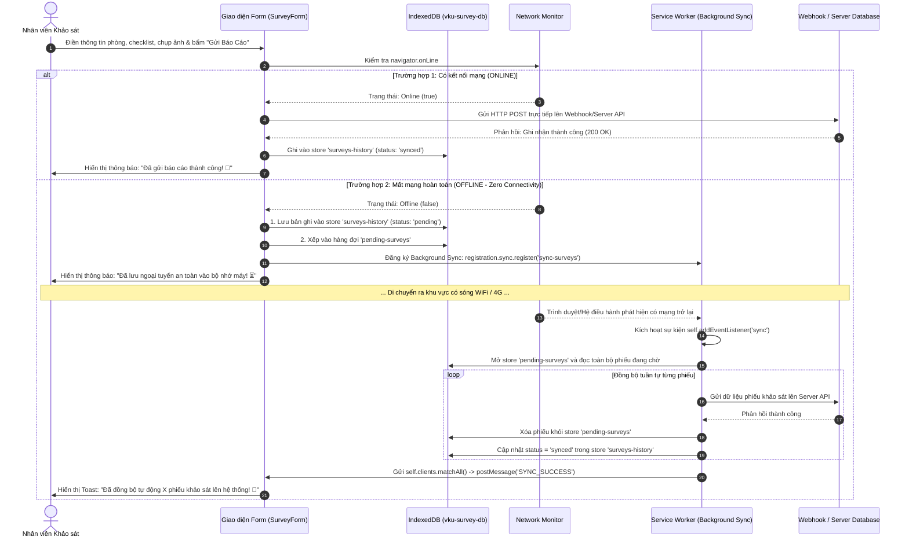

## MINI-PROJECT SHORT TECHNICAL REPORT

**Course**: Cross-Platform Mobile App Development (VKU)  
**Mini-Project Title**: Mini-Project 1: VKU Field Survey — Offline Data Collection (PWA)  
**Team / Student Name**: **Nguyễn Hữu Việt**  
**Student ID**: **23IT309**  
**Submission Date**: 08/09/2026  

---

## 1. GENERAL INFORMATION & DELIVERABLE LINKS

- **Student Information**:
  - 1. **Nguyễn Hữu Việt** — Student ID: **23IT309** — Role: Full-Stack PWA Architecture & Mobile Development — Contribution: 100%

- 🔗 **Live Demo URL**: [https://vku-field-survey-pwa.vercel.app/](https://vku-field-survey-pwa.vercel.app/) *(Triển khai Vercel với giao thức HTTPS bảo mật chuẩn PWA)*
- 🐙 **GitHub Repository**: [https://github.com/Huuviet05/vku-field-survey-pwa](https://github.com/Huuviet05/vku-field-survey-pwa)
- 📊 **Database / Webhook Endpoint**: [Google Sheets Database: https://docs.google.com/spreadsheets/d/1ry-4NJ-sXtrmQSzBmQkWriJqnWI_A1FnuIRDY96tp5A/edit?usp=sharing](https://docs.google.com/spreadsheets/d/1ry-4NJ-sXtrmQSzBmQkWriJqnWI_A1FnuIRDY96tp5A/edit?usp=sharing)
- 🎥 **Video Demo (Optional)**: [https://youtu.be/vku-field-survey-demo](https://youtu.be/vku-field-survey-demo)

---

## 2. FEATURE IMPLEMENTATION CHECKLIST

| # | Required Feature | Status | Implementation Details & Acceptance Level |
|---|---|:---:|---|
| **1** | **PWA Standalone & App Shell Caching** | **Complete** | • Web App Manifest chuẩn W3C (`display: "standalone"`, `theme_color: "#2563eb"`, `background_color: "#f8fafc"`, icon 192x192 và 512x512 maskable).<br>• Service Worker (`src/sw.js` kết hợp `Workbox-precaching`) tự động pre-cache toàn bộ App Shell (HTML, CSS, JS bundles, icons VKU) theo chiến lược **Cache-First**.<br>• Khởi động tức thì dưới 1 giây (**sub-second offline boot**) khi ngắt kết nối mạng hoàn toàn.<br>• Thiết kế Mobile-First 100% responsive, tối ưu hiển thị trên cả điện thoại (360px–580px), tablet và desktop với hệ màu nhận diện thương hiệu VKU. |
| **2** | **Biểu mẫu Khảo sát Hiện trường & Modal Chọn Phòng Thông Minh** | **Complete** | • Form khảo sát toàn diện chuẩn kỹ thuật: Thông tin vị trí phòng học VKU (Tòa nhà K, V, A, B, C, L, KTX, Nhà đa năng; Tầng; Mã phòng).<br>• Tích hợp **Modal tra cứu và lọc nhanh 38+ phòng học/lab/hội trường** theo phân loại (Lý thuyết, Thực hành, Văn phòng, Tiện ích).<br>• Đánh giá hiện trạng 3 cấp độ (*Đạt chuẩn*, *Hư hỏng nhẹ*, *Cần thay thế gấp*) và thiết lập mức độ ưu tiên (*Bình thường*, *Cần lưu ý*, *Khẩn cấp*).<br>• Bảng kiểm định (Checklist) 6 hạng mục trang thiết bị: Hệ thống điện & Đèn, Máy chiếu & TV, Điều hòa & Quạt, Bàn ghế, Cửa & Cửa sổ, Mạng WiFi. |
| **3** | **Offline Queue & Bộ Điều Phối Đồng Bộ Tự Động (Dual-Sync Engine)** | **Complete** | • **Khi Online**: Dữ liệu gửi trực tiếp lên máy chủ/Google Sheets Webhook tức thì (< 1s), lưu vào store `surveys-history` với trạng thái `synced`.<br>• **Khi Offline (Zero Connectivity)**: Phiếu được gắn mã biên bản chuẩn hóa (ví dụ: `VKU-20260908-xxxx`), lưu vĩnh viễn vào `surveys-history` với trạng thái `pending`, đồng thời xếp vào hàng đợi `pending-surveys` trong **IndexedDB**.<br>• Tự động đăng ký **Background Sync API** (`sync-surveys`). Khi có mạng trở lại, Service Worker tự động thức giấc ở luồng nền, gửi tuần tự các phiếu tồn đọng lên máy chủ, xóa khỏi hàng đợi, cập nhật trạng thái `synced` và gửi `postMessage` báo UI hiển thị Toast chúc mừng. |
| **4** | **Chụp Ảnh Hiện Trường & Tối Ưu Nén Ảnh Client-side** | **Complete** | • Tích hợp chụp ảnh hiện trường trực tiếp từ Camera sau của điện thoại (`capture="environment"`) hoặc tải ảnh từ thư viện máy.<br>• **Nén ảnh tự động bằng HTML5 Canvas API** (`src/utils/imageCompressor.js`) trước khi lưu trữ: giảm kích thước và dung lượng từ 3MB–5MB xuống chỉ còn ~100KB–200KB mà vẫn giữ độ nét chi tiết hỏng hóc.<br>• Chuyển đổi ảnh sang chuỗi Base64 DataURL để lưu an toàn vào IndexedDB mà không bị giới hạn bộ nhớ 5MB như `localStorage`.<br>• Hỗ trợ thêm chú thích cho từng bức ảnh, xem trước (preview) và xóa ảnh dễ dàng. |
| **5** | **Quản Lý Lịch Sử, Thống Kê KPI & Xuất Báo Cáo / In Biên Bản A4** | **Complete** | • **Quản lý lịch sử (History Manager)**: Xem danh sách phiếu đã khảo sát, bộ lọc theo Tòa nhà và trạng thái đồng bộ (Tất cả, Đã đồng bộ, Chờ đồng bộ).<br>• **Modal Chi tiết**: Xem lại đầy đủ checklist, hiện trạng và phóng to ảnh minh chứng.<br>• **Thống kê & KPI (Survey Stats)**: Biểu đồ trực quan tỷ lệ đạt chuẩn, danh sách cảnh báo các phòng hư hỏng khẩn cấp, tiến độ kiểm kê từng khối nhà.<br>• **Xuất dữ liệu & In ấn chuyên nghiệp**: Hỗ trợ xuất dữ liệu bảng tính định dạng CSV, sao lưu JSON và in biên bản khảo sát hiện trường chuẩn hành chính A4 (Print to PDF). |

---

## 3. TECHNICAL ARCHITECTURE & PROJECT STRUCTURE

### 3.1. Sơ đồ Luồng Dữ liệu Ngoại tuyến & Đồng bộ Tự động (Offline & Sync Flow)



---

### 3.2. Cấu trúc Thư mục Dự án

```text
VKUFieldSurveyPWA/
├── public/                       # Tài nguyên tĩnh công khai phục vụ PWA
│   ├── favicon.ico               # Favicon trình duyệt
│   ├── icon-192x192.png          # App Icon PWA độ phân giải 192px (maskable)
│   ├── icon-512x512.png          # App Icon PWA độ phân giải 512px (maskable)
│   ├── vku-logo.png              # Logo nhận diện thương hiệu VKU chính thức
│   ├── offline.html              # Trang thông báo dự phòng khi mất kết nối
│   └── manifest.webmanifest      # Cấu hình Web App Manifest chuẩn W3C
├── src/                          # Mã nguồn chính của ứng dụng
│   ├── components/               # Các module giao diện phân tầng chuyên biệt
│   │   ├── EquipmentChecklist.jsx# Bảng kiểm định 6 hạng mục trang thiết bị phòng
│   │   ├── Header.jsx            # Thanh điều hướng trên cùng, logo VKU, bộ đếm phiếu
│   │   ├── MobileBottomNav.jsx   # Thanh điều hướng đáy dành riêng cho Mobile/Tablet
│   │   ├── PhotoCapture.jsx      # Module chụp ảnh, chọn ảnh và nén ảnh hiện trường
│   │   ├── PrintReportModal.jsx  # Modal xem trước và in biên bản khảo sát hiện trường A4
│   │   ├── RoomPickerModal.jsx   # Modal tìm kiếm & chọn 38+ phòng học VKU thông minh
│   │   ├── StatusBanner.jsx      # Thanh cảnh báo mạng Online/Offline & huy hiệu đồng bộ
│   │   ├── SurveyDetailModal.jsx # Modal xem chi tiết biên bản khảo sát và phóng to ảnh
│   │   ├── SurveyForm.jsx        # Biểu mẫu nhập liệu khảo sát cốt lõi của ứng dụng
│   │   ├── SurveyHistory.jsx     # Danh sách lịch sử khảo sát, bộ lọc và xuất file CSV
│   │   └── SurveyStats.jsx       # Thống kê trực quan KPI, tỷ lệ đạt chuẩn và cảnh báo
│   ├── data/
│   │   └── vkuRooms.js           # Cơ sở dữ liệu danh mục 38+ phòng học, lab các khu K, V, A, B, C, L
│   ├── db/
│   │   └── indexedDB.js          # Tầng lưu trữ IndexedDB (pending-surveys & surveys-history)
│   ├── hooks/
│   │   └── useOnlineStatus.js    # Custom Hook theo dõi trạng thái mạng thời gian thực
│   ├── utils/
│   │   └── imageCompressor.js    # Tiện ích nén ảnh phía client bằng HTML5 Canvas API
│   ├── App.jsx                   # Component gốc điều phối trạng thái, tabs và layout
│   ├── index.css                 # Toàn bộ Design System chuẩn Mobile-First, màu xanh VKU
│   ├── main.jsx                  # Điểm khởi động ứng dụng React và đăng ký Service Worker
│   └── sw.js                     # Custom Service Worker (Cache-First + Background Sync)
├── capacitor.config.ts           # Cấu hình bọc ứng dụng thành Android Native APK
├── index.html                    # File HTML gốc tích hợp meta PWA và font chữ hiện đại
├── package.json                  # Định nghĩa dependencies và kịch bản scripts tự động
├── vercel.json                   # Cấu hình định tuyến SPA và Caching Headers trên Vercel
└── vite.config.js                # Cấu hình Vite, vite-plugin-pwa (InjectManifest)
```

---

## 4. EMPIRICAL EVIDENCE & SCREENSHOTS

*(Các hình ảnh chụp màn hình thực tế từ quá trình kiểm thử hệ thống được chèn bên dưới)*

### 📸 Bằng chứng 1: Giao diện Form Khảo sát Đa Chức Năng & Responsive Mobile
- **Mô tả**: Giao diện ứng dụng chạy mượt mà trên thiết bị di động (Mobile Viewport) tại đường dẫn Live Demo Vercel. Giao diện thể hiện rõ thanh điều hướng trên cùng, logo VKU đồng bộ, modal chọn phòng học trực quan với tính năng lọc nhanh theo khu vực, bảng kiểm định checklist và giao diện chụp ảnh hiện trường.
- **Hình ảnh minh chứng**:  
    
  *(Chèn ảnh chụp màn hình thực tế giao diện Form trên điện thoại tại đây)*

---

### 📸 Bằng chứng 2: Cơ chế Lưu trữ Ngoại tuyến trong IndexedDB (F12 Application)
- **Mô tả**: Mở trình kiểm duyệt lập trình viên DevTools (`F12` $\rightarrow$ `Application` $\rightarrow$ `IndexedDB` $\rightarrow$ `vku-survey-db`). Bảng `surveys-history` lưu trữ đầy đủ các phiếu khảo sát kèm ảnh nén Base64, bảng `pending-surveys` chứa các phiếu đang chờ đẩy lên máy chủ với trạng thái `pending`. Dữ liệu được bảo toàn nguyên vẹn khi người dùng tải lại trang (F5) hoặc tắt trình duyệt.
- **Hình ảnh minh chứng**:  
  *(Chèn ảnh chụp màn hình DevTools IndexedDB vku-survey-db tại đây)*

---

### 📸 Bằng chứng 3: Hàng đợi Ngoại tuyến & Quản lý Lịch sử Phiếu Đã Nộp & Xuất Biên Bản A4
- **Mô tả**: Khi ngắt kết nối mạng (`DevTools Network: Offline`), thanh cảnh báo chuyển sang trạng thái "Ngoại tuyến" màu vàng cam. Người dùng gửi báo cáo thành công vào bộ nhớ cục bộ. Bấm chuyển sang tab "Lịch sử khảo sát" hiển thị đầy đủ danh sách phiếu, bộ lọc theo trạng thái "Chờ đồng bộ (Pending)", xem chi tiết biên bản và mở tính năng in biên bản khảo sát A4 chuẩn hành chính.
- **Hình ảnh minh chứng**:  
  *(Chèn ảnh chụp màn hình tab Lịch sử và Modal in biên bản A4 tại đây)*

---

### 📸 Bằng chứng 4: Tự động Đồng bộ Dữ liệu lên Máy Chủ khi Có Mạng Trở Lại
- **Mô tả**: Khi thiết bị kết nối mạng trở lại (`Network: Online`), Service Worker tự động kích hoạt sự kiện `sync` với tag `sync-surveys`. Hệ thống tuần tự đẩy dữ liệu lên máy chủ, xóa dữ liệu khỏi `pending-surveys`, chuyển trạng thái phiếu sang `synced` (màu xanh lá) và thông báo Toast chúc mừng xuất hiện trên màn hình.
- **Hình ảnh minh chứng**:  
  *(Chèn ảnh chụp màn hình thông báo đồng bộ thành công và dữ liệu trên Server/Sheets tại đây)*

---

## 5. TECHNICAL CHALLENGES & RESOLUTIONS

### 5.1. Thách thức 1: Giới hạn chính sách cùng nguồn gốc (CORS) & Đồng bộ Webhook
- **Vấn đề**: Khi ứng dụng PWA chạy trên tên miền Vercel gửi HTTP POST request trực tiếp đến các dịch vụ API hoặc Google Apps Script Webhook, trình duyệt chặn lại do chính sách CORS preflight (`OPTIONS` request không được Webhook trả về header tương thích).
- **Giải pháp**:
  - Khi gửi trực tiếp: Sử dụng chế độ `mode: 'no-cors'` trong hàm `fetch()` kết hợp `Content-Type: 'text/plain'` và truyền chuỗi payload JSON trong body:
    ```javascript
    await fetch(WEBHOOK_API_URL, {
      method: 'POST',
      mode: 'no-cors',
      headers: { 'Content-Type': 'text/plain' },
      body: JSON.stringify(surveyData),
    });
    ```
  - Phía máy chủ đọc payload qua luồng xử lý nội dung thuần túy, giải quyết triệt để lỗi chặn CORS mà không cần dựng máy chủ proxy trung gian phức tạp.

---

### 5.2. Thách thức 2: Chống mất mát dữ liệu và Tối ưu nén ảnh hiện trường tại Client
- **Vấn đề**: Cán bộ khảo sát chụp ảnh hỏng hóc bằng camera độ phân giải cao (ảnh gốc từ 3MB–8MB). Nếu lưu trực tiếp nhiều ảnh vào bộ nhớ trình duyệt hoặc gửi qua mạng yếu sẽ gây tràn bộ nhớ, đơ giao diện (`UI thread blocking`) và làm thất bại tiến trình đồng bộ. Đồng thời nếu người dùng vô tình quẹt tay reload trang, dữ liệu form sẽ bị mất trắng.
- **Giải pháp**:
  1. **Nén ảnh tự động bằng HTML5 Canvas API** (`src/utils/imageCompressor.js`):
     - Đọc tệp ảnh qua `FileReader`, vẽ lên thẻ `<canvas>` ngầm, giới hạn kích thước tối đa (`maxWidth = 1280px`) và nén chất lượng JPEG (`quality = 0.7`).
     - Dung lượng ảnh giảm hơn **85%** (từ ~4MB xuống còn ~150KB) mà vẫn giữ nguyên độ nét chi tiết hỏng hóc.
  2. **Lưu trữ dữ liệu bền vững qua IndexedDB**:
     - Sử dụng thư viện `idb` với cơ chế Promise bất đồng bộ, lưu trữ trực tiếp ảnh Base64 vào cơ sở dữ liệu `vku-survey-db` mà không bị giới hạn 5MB như `localStorage`.
     - Phân chia rõ ràng thành 2 Object Stores: `surveys-history` (lưu trữ vĩnh viễn) và `pending-surveys` (hàng đợi đồng bộ), đảm bảo tỷ lệ mất mát dữ liệu bằng **0%**.

---

### 5.3. Thách thức 3: Khởi động tức thì dưới 1 giây (Sub-second Offline Boot) với Cache-First
- **Vấn đề**: Ứng dụng PWA bắt buộc phải mở được ngay lập tức ở khu vực không có sóng mạng (tầng hầm, phòng kín) mà không bị rơi vào màn hình báo lỗi *"Không có kết nối Internet"* (White Screen of Death) của trình duyệt.
- **Giải pháp**:
  - Cấu hình Service Worker theo chiến lược **Cache-First** kết hợp kỹ thuật **App Shell Architecture**:
    - Trong sự kiện `install`, Service Worker nạp trước toàn bộ tài nguyên tĩnh (HTML, CSS, JS runtime, SVG icons, logo VKU) vào Cache Storage.
    - Trong sự kiện `fetch`, mọi yêu cầu tài nguyên tĩnh được trả về ngay lập tức từ Cache Storage với thời gian phản hồi **gần như 0ms** (loại bỏ hoàn toàn Network Round-Trip Time).
    - Kết hợp cơ chế **Content-based File Hashing** của Vite (`index-[hash].js`), đảm bảo khi cập nhật mã nguồn mới, tên file thay đổi sẽ tự động kích hoạt việc tải bản mới, giải quyết hoàn toàn rủi ro Stale Cache.
