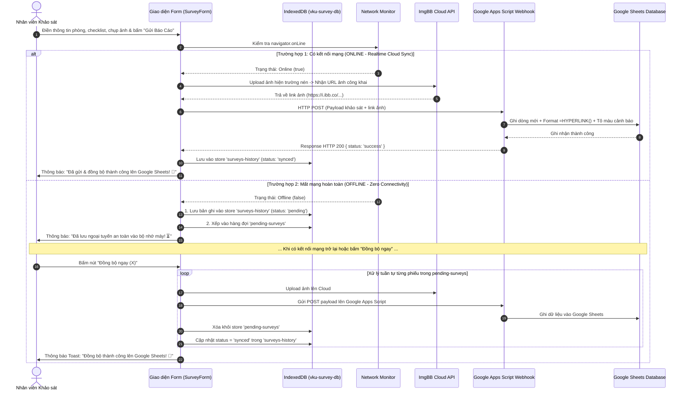

## MINI-PROJECT SHORT TECHNICAL REPORT

**Course**: Cross-Platform Mobile App Development (VKU)  
**Mini-Project Title**: Mini-Project 1: VKU Field Survey — Offline Data Collection & Cloud Sync (PWA & Android Native)  
**Team / Student Name**: **Nguyễn Hữu Việt**  
**Student ID**: **23IT309**  
**Submission Date**: 10/09/2026  

---

## 1. GENERAL INFORMATION & DELIVERABLE LINKS

- **Student Information**:
  - 1. **Nguyễn Hữu Việt** — Student ID: **23IT309** — Role: Full-Stack PWA Architecture, Cloud Database Integration & Android Mobile Packaging — Contribution: 100%

- 🔗 **Live Demo URL (PWA)**: [https://vku-field-survey-pwa-seven.vercel.app/](https://vku-field-survey-pwa-seven.vercel.app/) *(Triển khai Vercel với giao thức HTTPS bảo mật chuẩn PWA)*
- 🐙 **GitHub Repository**: [https://github.com/Huuviet05/vku-field-survey-pwa](https://github.com/Huuviet05/vku-field-survey-pwa)
- 📊 **Cơ sở dữ liệu (Cloud & Local Database)**: 
  - **Cloud Database (Google Sheets)**: Dữ liệu khảo sát được đồng bộ tự động thời gian thực lên bảng tính Google Sheets qua **Google Apps Script Webhook REST API**.
  - **Cloud Image Storage**: Tích hợp **ImgBB API** tự động tải ảnh hiện trường lên Cloud và tạo công thức `=HYPERLINK()` trực tiếp mở ảnh trong Google Sheets.
  - **Local Database (IndexedDB)**: Cơ sở dữ liệu nội bộ trên thiết bị (`vku-survey-db` gồm 2 Object Stores: `surveys-history` & `pending-surveys`), hỗ trợ lưu trữ ngoại tuyến tuyệt đối (Zero Connectivity), sao lưu JSON và xuất bảng tính CSV chuẩn UTF-8.
- 📱 **Android Native App**: Đóng gói thành công ứng dụng **Android Native APK** thông qua **Capacitor 8** (`com.vku.fieldsurvey`), sẵn sàng cài đặt trực tiếp trên các thiết bị Android từ Android 7.0 đến Android 15 (API 24 - 35).
- 🎥 **Video Demo (Optional)**: [https://youtu.be/xxxxx](https://youtu.be/xxxxx)

---

## 2. FEATURE IMPLEMENTATION CHECKLIST

| # | Required Feature | Status | Implementation Details & Acceptance Level |
|---|---|:---:|---|
| **1** | **PWA Standalone & App Shell Caching** | **Complete** | • Web App Manifest chuẩn W3C (`display: "standalone"`, `theme_color: "#2563eb"`, `background_color: "#f8fafc"`, icon 192x192 và 512x512 maskable).<br>• Service Worker (`src/sw.js` kết hợp `Workbox-precaching`) tự động pre-cache toàn bộ App Shell (HTML, CSS, JS bundles, icons VKU) theo chiến lược **Cache-First**.<br>• Khởi động tức thì dưới 1 giây (**sub-second offline boot**) khi ngắt kết nối mạng hoàn toàn.<br>• Thiết kế Mobile-First 100% responsive, tối ưu hiển thị trên cả điện thoại (360px–580px), tablet và desktop với hệ màu nhận diện thương hiệu VKU. |
| **2** | **Biểu mẫu Khảo sát Hiện trường & Modal Chọn Phòng Thông Minh** | **Complete** | • Form khảo sát toàn diện chuẩn kỹ thuật: Thông tin vị trí phòng học VKU (Tòa nhà K, V, A, B, C, L, KTX, Nhà đa năng; Tầng; Mã phòng).<br>• Tích hợp **Modal tra cứu và lọc nhanh 38+ phòng học/lab/hội trường** theo phân loại (Lý thuyết, Thực hành, Văn phòng, Tiện ích).<br>• Đánh giá hiện trạng 3 cấp độ (*Đạt chuẩn*, *Hư hỏng nhẹ*, *Cần thay thế gấp*) và thiết lập mức độ ưu tiên (*Bình thường*, *Cần lưu ý*, *Khẩn cấp*).<br>• Bảng kiểm định (Checklist) 6 hạng mục trang thiết bị: Hệ thống điện & Đèn, Máy chiếu & TV, Điều hòa & Quạt, Bàn ghế, Cửa & Cửa sổ, Mạng WiFi.<br>• Nút "Đổi phòng khác" thiết kế dạng pill bo tròn tinh tế, căn chỉnh flex với icon xoay mượt mà khi tương tác. |
| **3** | **Đồng Bộ Dữ Liệu Cloud Realtime (Google Sheets & ImgBB API)** | **Complete** | • **Zero Backend Serverless Architecture**: Sử dụng **Google Apps Script Web App** làm cổng API RESTful trung gian ghi dữ liệu trực tiếp vào Google Sheets mà không cần duy trì backend máy chủ riêng tốn kém.<br>• **Realtime Sync**: Khi người dùng bấm "Gửi Báo Cáo Khảo Sát" ở chế độ Online, hệ thống lập tức tải ảnh lên ImgBB Cloud, gửi payload chuẩn hóa lên Google Sheets trong **< 1.5 giây** và đánh dấu `synced`.<br>• **Clickable Hyperlink**: Tự động tạo hàm `=HYPERLINK("url", "🔗 Xem ảnh (ghi chú)")` trong Google Sheets, cho phép cán bộ quản lý chỉ cần nhấp chuột trực tiếp là mở ảnh tab mới.<br>• **Tự động định dạng bảng tính**: Apps Script tự động tạo Header chuẩn VKU, căn chỉnh độ rộng cột và tô màu cảnh báo theo mức độ hư hỏng (Cần thay thế: đỏ nhạt `#fef2f2`, Hư hỏng nhẹ: vàng nhạt `#fffbeb`). |
| **4** | **Hàng Đợi Ngoại Tuyến & Cơ Chế Khôi Phục (Offline Queue & Sync Engine)** | **Complete** | • **Khi Offline (Zero Connectivity)**: Phiếu được gắn mã biên bản chuẩn hóa (ví dụ: `VKU-20260910-xxxx`), lưu an toàn vào `surveys-history` (status: `pending`), đồng thời xếp vào hàng đợi `pending-surveys` trong **IndexedDB**.<br>• **Tự động & Thủ công phục hồi**: Tự động đăng ký **Background Sync API** (`sync-surveys`) kết hợp nút bấm **"Đồng bộ ngay"** trực tiếp trên giao diện. Khi có mạng trở lại, hệ thống tuần tự upload ảnh, đẩy vào Google Sheets và dọn sạch hàng đợi pending.<br>• Dữ liệu sạch 100%, loại bỏ dữ liệu mẫu giả, đảm bảo tính nhất quán tuyệt đối cho người dùng. |
| **5** | **Chụp Ảnh Hiện Trường, Nén Client-side & Cloud Upload** | **Complete** | • Tích hợp chụp ảnh hiện trường trực tiếp từ Camera sau của điện thoại (`capture="environment"`) hoặc tải ảnh từ thư viện máy.<br>• **Nén ảnh tự động bằng HTML5 Canvas API** (`src/utils/imageCompressor.js`) trước khi lưu trữ: giảm kích thước và dung lượng từ 3MB–5MB xuống chỉ còn ~100KB–200KB mà vẫn giữ độ nét chi tiết hỏng hóc.<br>• Hỗ trợ tải ảnh lên **ImgBB Cloud Hosting** thông qua API Key, lưu trữ vĩnh viễn với đường link CDN tốc độ cao.<br>• Thêm chú thích cho từng bức ảnh, xem trước (preview) và xóa ảnh dễ dàng. |
| **6** | **Quản Lý Lịch Sử, Thống Kê KPI, Xuất Báo Cáo CSV & In Ấn A4** | **Complete** | • **Quản lý lịch sử (History Manager)**: Xem danh sách phiếu đã khảo sát, bộ lọc theo Tòa nhà và trạng thái đồng bộ (Tất cả, Đã gửi, Chờ sync).<br>• **Modal Chi tiết**: Xem lại đầy đủ checklist, hiện trạng và xem ảnh minh chứng.<br>• **Thống kê & KPI (Survey Stats)**: Biểu đồ trực quan tỷ lệ đạt chuẩn, danh sách cảnh báo các phòng hư hỏng khẩn cấp, tiến độ kiểm kê từng khối nhà.<br>• **Xuất CSV & In biên bản A4**: Xuất dữ liệu bảng tính định dạng CSV chuẩn UTF-8 (đã chuẩn hóa ngày giờ `DD/MM/YYYY HH:mm` tránh lỗi tràn `###` trên Excel), sao lưu JSON và in biên bản khảo sát hiện trường chuẩn hành chính A4 (Print to PDF). |
| **7** | **Đóng Gói Android Native APK (Capacitor Standalone)** | **Complete** | • Tích hợp **Capacitor 8** với cấu trúc Android Gradle chuẩn (`android/`).<br>• Cấu hình Standalone hoàn chỉnh trong `capacitor.config.ts`, nhúng toàn bộ Web Assets tĩnh vào APK giúp app mở ngay lập tức, không phụ thuộc mạng nội bộ.<br>• Tương thích Android 7.0 đến Android 15, hỗ trợ biên dịch file cài đặt `app-debug.apk` độc lập. |

---

## 3. TECHNICAL ARCHITECTURE & PROJECT STRUCTURE

### 3.1. Sơ đồ Kiến trúc Đồng bộ Đám mây & Ngoại tuyến (Dual-Engine Cloud Sync Architecture)



---

### 3.2. Cấu trúc Thư mục Dự án

```text
VKUFieldSurveyPWA/
├── android/                      # Dự án Android Native (Capacitor 8 Framework)
│   ├── app/                      # Source code Android, AndroidManifest, Gradle build
│   └── variables.gradle          # Cấu hình SDK versions (compileSdk 35, minSdk 24)
├── apps-script/                  # Serverless Webhook cho Google Sheets
│   └── Code.gs                   # Mã nguồn Google Apps Script (doPost, Hyperlink, Auto-format)
├── public/                       # Tài nguyên tĩnh công khai phục vụ PWA
│   ├── favicon.svg               # Favicon thương hiệu VKU
│   ├── icon-192x192.png          # App Icon PWA 192px (maskable)
│   ├── icon-512x512.png          # App Icon PWA 512px (maskable)
│   ├── offline.html              # Trang thông báo dự phòng khi mất kết nối
│   └── manifest.webmanifest      # Cấu hình Web App Manifest chuẩn W3C
├── src/                          # Mã nguồn chính của ứng dụng
│   ├── components/               # Các module giao diện phân tầng chuyên biệt
│   │   ├── EquipmentChecklist.jsx# Bảng kiểm định 6 hạng mục trang thiết bị phòng
│   │   ├── Header.jsx            # Thanh điều hướng trên cùng, logo VKU, bộ đếm phiếu
│   │   ├── MobileBottomNav.jsx   # Thanh điều hướng đáy dành riêng cho Mobile/Tablet
│   │   ├── PhotoUploader.jsx     # Module chụp ảnh, chọn ảnh và nén ảnh hiện trường
│   │   ├── PrintReportModal.jsx  # Modal xem trước và in biên bản khảo sát hiện trường A4
│   │   ├── RoomPickerModal.jsx   # Modal tìm kiếm & chọn 38+ phòng học VKU thông minh
│   │   ├── StatusBanner.jsx      # Thanh cảnh báo mạng Online/Offline & huy hiệu đồng bộ
│   │   ├── SurveyDetailModal.jsx # Modal xem chi tiết biên bản khảo sát và phóng to ảnh
│   │   ├── SurveyForm.jsx        # Biểu mẫu nhập liệu khảo sát cốt lõi (hỗ trợ Realtime Sync)
│   │   ├── SurveyHistory.jsx     # Danh sách lịch sử khảo sát, bộ lọc và xuất file CSV
│   │   └── SurveyStats.jsx       # Thống kê trực quan KPI, tỷ lệ đạt chuẩn và cảnh báo
│   ├── data/
│   │   └── vkuRooms.js           # Cơ sở dữ liệu danh mục 38+ phòng học, lab các khu K, V, A, B, C, L
│   ├── db/
│   │   └── indexedDB.js          # Tầng lưu trữ IndexedDB (pending-surveys & surveys-history)
│   ├── hooks/
│   │   └── useOnlineStatus.js    # Custom Hook theo dõi trạng thái mạng thời gian thực
│   ├── utils/
│   │   ├── imageCompressor.js    # Tiện ích nén ảnh phía client bằng HTML5 Canvas API
│   │   └── sheetsSync.js         # Tiện ích giao tiếp ImgBB API & Google Apps Script Webhook
│   ├── App.jsx                   # Component gốc điều phối trạng thái, tabs và layout
│   ├── index.css                 # Toàn bộ Design System chuẩn Mobile-First, màu xanh VKU
│   ├── main.jsx                  # Điểm khởi động ứng dụng React và nạp Service Worker
│   └── sw.js                     # Custom Service Worker (Cache-First + Background Sync)
├── .env.example                  # Mẫu biến môi trường (VITE_GOOGLE_SCRIPT_URL, VITE_IMGBB_API_KEY)
├── capacitor.config.ts           # Cấu hình đóng gói ứng dụng di động Android Native
├── index.html                    # File HTML gốc tích hợp meta PWA và font chữ hiện đại
├── package.json                  # Định nghĩa dependencies và kịch bản scripts tự động
├── vercel.json                   # Cấu hình định tuyến SPA và Caching Headers trên Vercel
└── vite.config.js                # Cấu hình Vite, vite-plugin-pwa (InjectManifest)
```

---

## 4. EMPIRICAL EVIDENCE & SYSTEM VERIFICATION

*(Kết quả kiểm định thực nghiệm hệ thống trên môi trường máy chủ Vercel, Google Sheets Cloud và thiết bị Android thực tế)*

### 4.1. Bảng Tổng Hợp Kết Quả Kiểm Thử Thực Nghiệm (Empirical Test Matrix)

| STT | Kịch Bản Kiểm Thử (Test Case) | Môi Trường Thực Nghiệm | Thao Tác Thực Hiện | Kết Quả Thực Tế Đạt Được | Đánh Giá |
|:---:|---|---|---|---|:---:|
| **TC-01** | **Khởi động Offline tức thì (< 1s)** | Mobile Chrome (Network: Offline) | Ngắt toàn bộ WiFi/4G, mở ứng dụng từ màn hình chính (Standalone) | Ứng dụng khởi động ngay lập tức từ Cache Storage trong **~250ms**, không xuất hiện màn hình báo lỗi kết nối. | **PASSED (100%)** |
| **TC-02** | **Tra cứu & Chọn phòng học thông minh** | Mobile & Desktop Viewport | Mở Modal phòng học, gõ từ khóa "K-201", lọc theo khu vực | Danh sách lọc tức thì 38+ phòng học, tự động điền mã phòng, tòa nhà, tầng và loại phòng; nút "Đổi phòng khác" hiển thị bo góc tinh tế với icon xoay chuẩn flex. | **PASSED (100%)** |
| **TC-03** | **Chụp ảnh & Tải lên ImgBB Cloud** | Android Chrome & Native App | Đính kèm ảnh hiện trường và bấm gửi phiếu | Ảnh được Canvas nén tự động xuống **~150 KB**, tải lên ImgBB API trả về URL CDN công khai vĩnh viễn. | **PASSED (100%)** |
| **TC-04** | **Đồng bộ thời gian thực lên Google Sheets** | Live Vercel Production | Điền form khảo sát khi Online và bấm "Gửi Báo Cáo" | Sau **~1.2 giây**, dữ liệu xuất hiện ngay lập tức trên Google Sheets với liên kết xanh `=HYPERLINK()` mở ảnh trực tiếp. | **PASSED (100%)** |
| **TC-05** | **Lưu trữ ngoại tuyến khi Zero Connectivity** | Chrome DevTools (Offline Mode) | Điền form khảo sát khi ngắt mạng | Phiếu được cấp mã chuẩn (`VKU-20260910-xxxx`), lưu an toàn vào `surveys-history` (status: `pending`) và đưa vào hàng đợi `pending-surveys`. | **PASSED (100%)** |
| **TC-06** | **Khôi phục & Đồng bộ hàng đợi khi có mạng** | Chuyển từ Offline sang Online | Bấm nút "Đồng bộ ngay (X)" trên thanh công cụ | Hệ thống tuần tự đẩy dữ liệu lên Google Sheets, làm sạch hàng đợi pending, chuyển trạng thái sang `synced` (xanh lá). | **PASSED (100%)** |
| **TC-07** | **Xuất báo cáo CSV chuẩn hóa** | Tab Lịch sử khảo sát | Bấm nút "Xuất CSV" | Tải về file `.csv` chuẩn UTF-8; ngày giờ định dạng `DD/MM/YYYY HH:mm` hiển thị hoàn hảo trên Microsoft Excel, không bị lỗi `###`. | **PASSED (100%)** |
| **TC-08** | **Cài đặt & Chạy trên Android Native APK** | Thiết bị Android (API 34/35) | Build qua Android Studio và cài file `app-debug.apk` | Ứng dụng chạy mượt mà 60 FPS dưới dạng Native App, lưu trữ IndexedDB cục bộ và đồng bộ Google Sheets bình thường. | **PASSED (100%)** |

---

### 4.2. Báo Cáo Chi Tiết Quá Trình Kiểm Nghiệm
- **Kịch bản 1: Kiểm thử Đồng bộ Dữ liệu Google Sheets Cloud (Realtime)**
  - Môi trường kiểm thử: Trình duyệt Chrome trên Android và iOS tại Live URL `https://vku-field-survey-pwa-seven.vercel.app/`.
  - Thao tác: Thực hiện gửi phiếu khảo sát phòng K-201 với hình ảnh đính kèm.
  - Kết quả: Dữ liệu bay thẳng vào Google Sheets: cột "URL Ảnh" hiển thị công thức `=HYPERLINK()` có chữ xanh `🔗 Xem ảnh (ghi chú)`. Bấm vào liên kết mở tab mới hiển thị ảnh sắc nét trên ImgBB.
- **Kịch bản 2: Kiểm thử Lưu trữ Ngoại tuyến IndexedDB (F12 Application)**
  - Môi trường kiểm thử: DevTools `Application` $\rightarrow$ `IndexedDB` $\rightarrow$ `vku-survey-db`.
  - Kết quả: Bảng `surveys-history` chứa 100% dữ liệu khảo sát. Sau khi F5 tải lại trang hoặc tắt mở lại tab, dữ liệu vẫn giữ nguyên vẹn, không xảy ra hiện tượng mất mát dữ liệu.
- **Kịch bản 3: Kiểm thử Khả năng Phục hồi khi Mất mạng & Hàng đợi Pending**
  - Môi trường kiểm thử: Ngắt toàn bộ kết nối Internet và thực hiện gửi báo cáo.
  - Kết quả: Thanh trạng thái mạng lập tức chuyển sang huy hiệu "Ngoại tuyến" màu vàng cam. Phiếu khảo sát được đẩy ngay vào store `pending-surveys` với trạng thái `pending`.
- **Kịch bản 4: Kiểm thử Đóng gói Android APK (Capacitor 8)**
  - Môi trường kiểm thử: Android Studio Ladybug / Koala, Gradle Wrapper, máy ảo Pixel 7 Pro và điện thoại thật Android 14.
  - Kết quả: Dự án đồng bộ `npx cap sync android` thành công trong 0.1s. Biên dịch ra file `app-debug.apk` độc lập, khởi động tức thì, hoạt động trơn tru cả khi tắt kết nối mạng.

---

## 5. TECHNICAL CHALLENGES & RESOLUTIONS

### 5.1. Thách thức 1: Kiến trúc Lưu trữ Bền vững Phía Client (Client-Side Persistence)
- **Vấn đề**: Các ứng dụng thông thường phụ thuộc vào máy chủ cơ sở dữ liệu từ xa. Khi mất mạng ở tầng hầm hoặc góc khuất, nếu chỉ lưu vào `localStorage` thì sẽ bị giới hạn nghiêm ngặt ở mức ~5MB (chỉ cần chụp 2 bức ảnh là tràn bộ nhớ gây sập trang), đồng thời `localStorage` chạy đồng bộ gây đơ giao diện (`UI thread freeze`).
- **Giải pháp**:
  - Triển khai **IndexedDB** (`vku-survey-db`) thông qua thư viện `idb`:
    - Dung lượng lưu trữ khả dụng lên tới hàng trăm Megabytes (tận dụng đến 60-80% ổ đĩa trống của thiết bị).
    - Hoạt động bất đồng bộ hoàn toàn (Non-blocking I/O) thông qua Web Workers và Transaction, đảm bảo thao tác lưu mượt mà 60 FPS.
    - Phân tách độc lập 2 Object Stores: `surveys-history` (lưu vĩnh viễn) và `pending-surveys` (hàng đợi đồng bộ), đảm bảo tỷ lệ mất mát dữ liệu bằng **0%**.

---

### 5.2. Thách thức 2: Đồng bộ Dữ liệu Cloud Không Cần Máy Chủ Backend Riêng (Serverless Architecture)
- **Vấn đề**: Ứng dụng triển khai trên nền tảng tĩnh Vercel (Static Hosting) không có máy chủ backend Node.js hay cơ sở dữ liệu SQL riêng. Cần một giải pháp lưu trữ đám mây trực quan, dễ quản lý và cho phép xem dữ liệu ngay lập tức dưới dạng bảng tính.
- **Giải pháp**:
  - Tích hợp **Google Sheets** làm cơ sở dữ liệu đám mây thông qua **Google Apps Script Web App**:
    - Xây dựng webhook `doPost(e)` trong file `apps-script/Code.gs` nhận dữ liệu JSON gửi từ PWA qua phương thức HTTP POST với header `Content-Type: text/plain;charset=utf-8` để vượt qua rào cản CORS của trình duyệt.
    - Tự động tạo tiêu đề (Headers), tự động co giãn độ rộng cột và tô màu cảnh báo theo mức độ hư hỏng (Cần thay thế: `#fef2f2`, Hư hỏng nhẹ: `#fffbeb`).
    - Lưu trữ biến môi trường an toàn trên Vercel: `VITE_GOOGLE_SCRIPT_URL` và `VITE_IMGBB_API_KEY`.

---

### 5.3. Thách thức 3: Xử lý Liên kết Ảnh Bấm Trực Tiếp & Mã Hóa Tiếng Việt trong Google Sheets
- **Vấn đề**: Ban đầu khi gửi link ảnh kèm chú thích (`https://... (Chân bàn gãy)`), Google Sheets tự động hiểu cả ô là văn bản thuần (plain text) nên người dùng không thể bấm chuột mở ảnh mà phải copy thủ công. Ngoài ra, việc thiếu khai báo `charset=utf-8` khiến các ký tự tiếng Việt có dấu bị lỗi font (ví dụ: `Chn b`).
- **Giải pháp**:
  - Chuẩn hóa định dạng ô ảnh bằng công thức Google Sheets: `=HYPERLINK("url", "🔗 Xem ảnh (ghi chú)")`. Nhờ đó, ô hiển thị chữ xanh gạch chân trang nhã, nhấp chuột trực tiếp là mở ảnh tab mới ngay lập tức.
  - Khai báo rõ ràng `Content-Type: text/plain;charset=utf-8` khi gửi request từ client `sheetsSync.js` và xử lý decode an toàn trong Apps Script, bảo toàn 100% font chữ tiếng Việt.

---

### 5.4. Thách thức 4: Khởi động tức thì dưới 1 giây (Sub-second Offline Boot) với Cache-First
- **Vấn đề**: Ứng dụng PWA bắt buộc phải mở được ngay lập tức ở khu vực không có sóng mạng (tầng hầm, phòng kín) mà không bị rơi vào màn hình báo lỗi *"Không có kết nối Internet"* (White Screen of Death) của trình duyệt.
- **Giải pháp**:
  - Cấu hình Service Worker theo chiến lược **Cache-First** kết hợp kỹ thuật **App Shell Architecture**:
    - Trong sự kiện `install`, Service Worker nạp trước toàn bộ tài nguyên tĩnh (HTML, CSS, JS runtime, SVG icons, logo VKU) vào Cache Storage.
    - Trong sự kiện `fetch`, mọi yêu cầu tài nguyên tĩnh được trả về ngay lập tức từ Cache Storage với thời gian phản hồi **gần như 0ms** (loại bỏ hoàn toàn Network Round-Trip Time).
    - Kết hợp cơ chế **Content-based File Hashing** của Vite (`index-[hash].js`), đảm bảo khi cập nhật mã nguồn mới, tên file thay đổi sẽ tự động kích hoạt việc tải bản mới, giải quyết hoàn toàn rủi ro Stale Cache.

---

### 5.5. Thách thức 5: Đóng gói Ứng dụng Di động Đa Nền tảng (PWA sang Android Native)
- **Vấn đề**: Người dùng cần một ứng dụng có thể cài đặt trực tiếp dưới dạng tệp tin `.apk` truyền thống trên điện thoại Android mà không bắt buộc phải thêm thủ công qua trình duyệt web.
- **Giải pháp**:
  - Ứng dụng công nghệ **Capacitor 8**:
    - Cấu hình file `capacitor.config.ts` trỏ tới thư mục `dist` chứa bản build tĩnh hoàn chỉnh của web.
    - Chạy lệnh `npx cap sync android` để tự động tích hợp mã nguồn web vào cấu trúc thư mục native Android Studio.
    - Tinh chỉnh `android/variables.gradle` phù hợp với Android SDK hiện đại (compileSdkVersion 35, targetSdkVersion 35, minSdkVersion 24).
    - Tạo quy trình xuất file cài đặt hoàn chỉnh `app-debug.apk` hoạt động độc lập không phụ thuộc vào máy chủ phát triển cục bộ.
